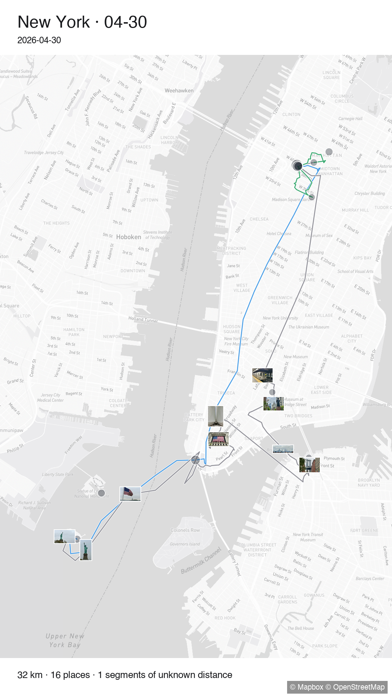
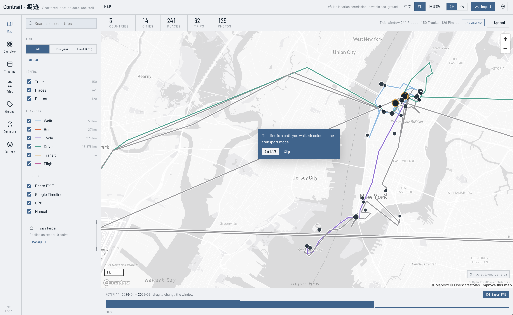

<h1 align="center">Contrail · 凝迹</h1>

<p align="center">
  Gather the location traces scattered across your devices into one complete trail — and the memories along it.<br>
  把散落在各处的位置情报，汇成完整的轨迹和回忆。
</p>

<p align="center">
  
</p>

<p align="center">
  <sub>One exported day · 一张导出的行程海报</sub>
</p>

---

## Contrail

**Contrail collects nothing.** It aggregates locations, tracks and photos — it does not gather them. Nothing runs in your pocket, no background service watches you, and there is no account to create.

It starts from what already exists: the photos on your disk, the Google Timeline export you requested, the GPX your watch wrote. Contrail stitches them into one continuous, queryable trail.

All of it runs on your own machine.

### From points to memory

A pile of coordinates and trip records is not a trail. The value lies in the work that follows — turning scattered data into something worth keeping.

Contrail tells a stay apart from a movement. It sews the fragments a single day left across four different recording streams into one narrative. And it separates the journey you want to remember from the commute you don't.

### What comes out

**Places and tracks.** Stays and movement, separated automatically. Repeated visits collapse into one place.

**Days that hold together.** A day becomes one trip. Crossing a timezone does not cut it in half.

**Commutes, folded away.** Rule-based detection — no model guessing at your life. Pure commute days can be deleted outright.

**Fences over every address you have ever had.** Not merely where you live now: every home and workplace in your history, inferred offline and confirmed by you. Export anything that touches one and the server demands an explicit blur-or-remove decision. A dialog can be bypassed. A refusal cannot.

**Posters.** Any trip rendered as the image at the top of this page.

Photos are read exactly once. Contrail keeps a thumbnail and the EXIF fields it needs — never the original, never the folder path. Nothing is retained that would let it go back and look again.

Currently not supported: share links, cloud sync, accounts, and any large language model in the product runtime.

---

<p align="center">
  
</p>


## 凝迹

**这是位置和轨迹，以及照片的聚合，不是采集程序。** 没有常驻的手机 App，没有后台服务，也不需要注册账号。基于已有的数据：磁盘里的照片、从 Google 申请导出的时间线、运动手表生成的 GPX，Contrail 把数据合成一条前后连贯、可以查询的轨迹。

全程在本地机器上运行。

### 从位置点到回忆

一堆位置点和行程记录不等于轨迹。真正的价值在于把散乱的数据变成有价值的回忆。

分辨哪些是停留、哪些是移动，把同一天散在不同记录流里的碎片缝成一条完整的叙事，并且把你想记住的旅程和不想记住的通勤区分开。

### 能得到什么

**地点与路途。** 自动区分停留与移动，反复去的地方合并成一个地点。

**完整的一天。** 一天归为一个行程，跨时区移动不会被切成两半。

**通勤折叠。** 规则法识别，不用模型去猜你的生活。纯通勤日可以直接删掉。

**覆盖全部历史住址的隐私围栏。** 不只是现在住的地方 —— 你住过、工作过的每一个地址，离线推算，由你确认。导出范围只要碰到围栏，服务端就强制你选「模糊」或「删除」。前端的对话框可以被绕过，服务端的拒绝不能。

**海报。** 任意行程渲染成本页顶部那样的图。

照片只读一次。只保留缩略图和必要的 EXIF 字段 —— 不留原图，不留目录路径。系统里不存在任何能让它回头再看一眼的东西。

当前不支持：分享链接、云同步、账号体系，以及产品运行时里的任何大模型。

---

## Supported files · 支持的文件

Detection reads content, not filenames: extension, then magic bytes, then a structural probe. An unrecognised file is reported with a sample rather than silently skipped. `.zip` archives are unpacked and scanned.

识别看内容不看文件名：先扩展名，再 magic bytes，最后结构探测。认不出的文件会带样本报出来，绝不静默跳过。`.zip` 会解开后逐个识别。

### Tracks & timelines · 轨迹与时间线

| Source · 来源 | Files · 文件 | |
|---|---|---|
| **Google Timeline** — on-device export, 2024-11 → | `Timeline.json` · `location-history.json` | Four record streams coexist in one file (`visit` / `activity` / `timelinePath` / `timelineMemory`), dispatched per record. The richest source by far. 一个文件里四种并行记录流，逐条分派，信息量最大。 |
| **Google Semantic Location History** — legacy Takeout | `*.json` | Per-month semantic segments. 按月的语义分段。 |
| **Google Records** — legacy Takeout | `Records.json` | The raw point stream. 原始点流。 |
| **GPX** | `.gpx` · `.xml` | Watches, phones, most route tools. 手表、手机、绝大多数路线工具。 |
| **TCX** | `.tcx` · `.xml` | Garmin Training Center. |
| **FIT** | `.fit` | Garmin binary; semicircle coordinates and the 1989-12-31 epoch handled. 已处理半圆坐标与 1989-12-31 纪元。 |

### Photos · 照片

`.jpg` `.jpeg` `.png` `.tif` `.tiff` `.heic` `.heif` `.dng`

Location comes from GPS EXIF when present; otherwise it is inferred from the timestamp against your track at that moment. HEIC needs the system `libheif`.

有 GPS EXIF 就直接用，没有就按拍摄时刻在当时的轨迹上推断。HEIC 需要系统装 `libheif`。

The folder is chosen through the OS-native picker, and **the path never enters an HTTP request** — the API receives a one-shot token instead. Path traversal is not guarded against so much as made structurally impossible.

照片目录通过系统原生选择框指定，**路径全程不进 HTTP 请求** —— 后端只交给前端一次性 token。路径遍历不是「防住了」，而是结构上无从发生。

---

## Tech stack · 技术栈

| | | |
|---|---|---|
| **Backend** | Python 3.12 · FastAPI · SQLAlchemy 2.0 · Pydantic v2 | Async request path; CPU-bound work goes to a process pool. 请求路径全异步，CPU 密集型工作交给进程池。 |
| **Database** | PostgreSQL 18 · PostGIS 3.6 · `pg_trgm` · `pgcrypto` | PostGIS carries the spatial index, tile generation **and the privacy-fence clipping**; `pg_trgm` makes CJK place search work. 空间索引、瓦片生成与**围栏裁剪**都由 PostGIS 承担。 |
| **Frontend** | React 18 · TypeScript (strict) · Vite 6 | |
| **Map** | Mapbox GL · deck.gl · **MVT** | Basemap and stored data are both WGS-84 — aligned by construction, no datum shift anywhere. 底图与库内数据同为 WGS-84，天然对齐，全程无坐标纠偏。 |
| **State** | TanStack Query · Zustand | Server state and client state, kept apart. 服务端状态与客户端状态分开管理。 |
| **Parsing** | `ijson` · `lxml` iterparse · `fitparse` · `exifread` | Streaming throughout: thirteen years of export is read without being loaded. 全程流式，13 年的导出文件不需要整个读进内存。 |
| **Imaging** | Pillow · **cairo** · `pillow-heif` | Pillow's line drawing has no antialiasing, so cairo draws the routes. Pillow 画线没有抗锯齿，路线交给 cairo。 |
| **Tasks** | in-process + SSE · ARQ + Redis reserved for cloud | Local imports stay in one process, so the photo path never leaves it. 本机导入不跨进程，照片路径因此不会离开 API 进程。 |

Native macOS install, no containers. Nothing leaves the machine except reverse geocoding, which can be switched off.

macOS 本机原生安装，不用容器。除了可以关掉的反向地理编码，没有任何数据离开这台机器。

---

## Getting started · 开始使用

Installation, first import and troubleshooting: **[SETUP.md](SETUP.md)**
安装、首次导入与排错：**[SETUP.md](SETUP.md)**

Once installed · 装好之后：

```bash
# terminal 1 · 终端 1
conda activate py312 && uvicorn contrail.main:app --host 127.0.0.1 --port 8000 --app-dir backend --reload

# terminal 2 · 终端 2
cd frontend && npm run dev
```

<http://127.0.0.1:5173>

## Documentation · 文档

| | |
|---|---|
| [SETUP.md](SETUP.md) | Installation, first run, troubleshooting · 安装、首次运行、排错 |
| [ARCHITECTURE.md](ARCHITECTURE.md) | Modules, pipeline, database, API index · 模块、流水线、数据库、API 一览 |
| [AGENTS.md](AGENTS.md) | Development rules, for humans and AI tools alike · 开发规则，人与 AI 工具通用 |
| `docs/` *(not in this repository)* | Design documents (Chinese) — the authority for any implementation. Kept out of the public repo because they are derived from real personal location history; distributed separately. · 设计文档，实现的唯一依据。因含真实个人位置数据的分析结果，不进公开仓库，单独分发。 |

## License · 许可

[MIT](LICENSE)
